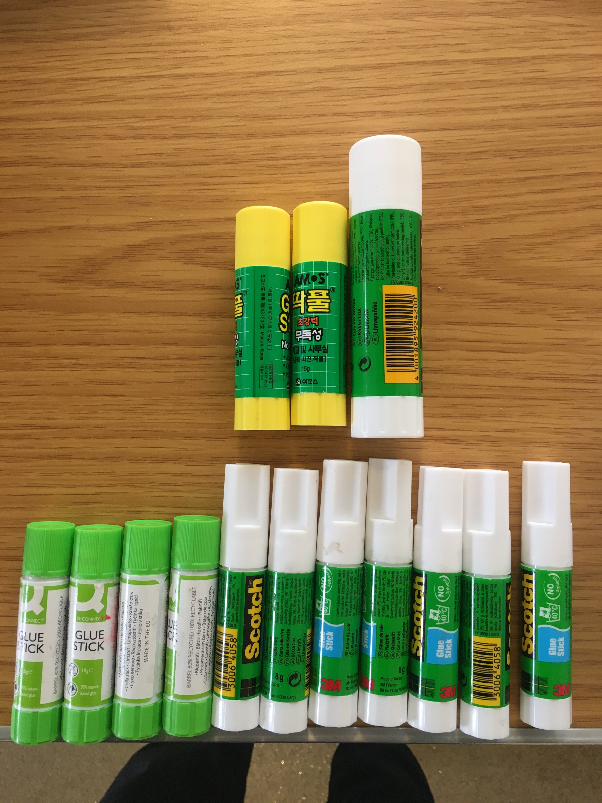

**[공지사항]** [와우 블로그 신규 업데이트 안내](https://nkec.oopy.io/newmaldenkoreanschool)
{: .notice--primary}

<div class="notice--success">
<h4>공지사항입니다.</h4>
<ul>
    <li> 공지사항 순서1</li>
    <li> 공지사항 순서2</li>
    <li> 공지사항 순서3</li>
</ul>
</div>

지킬 블로그에 대해 알아보겠습니다.
{: .align-right}


[버튼](https://google.com){: .btn .btn--danger}



# heading test 풀 이미지

{: .img-width-half .align-center}

## heading test 2-1
### heading test 3

**hello world**
this is a test.

```python
1+1=2
```

## heading test 2-2


## heading test 2-3